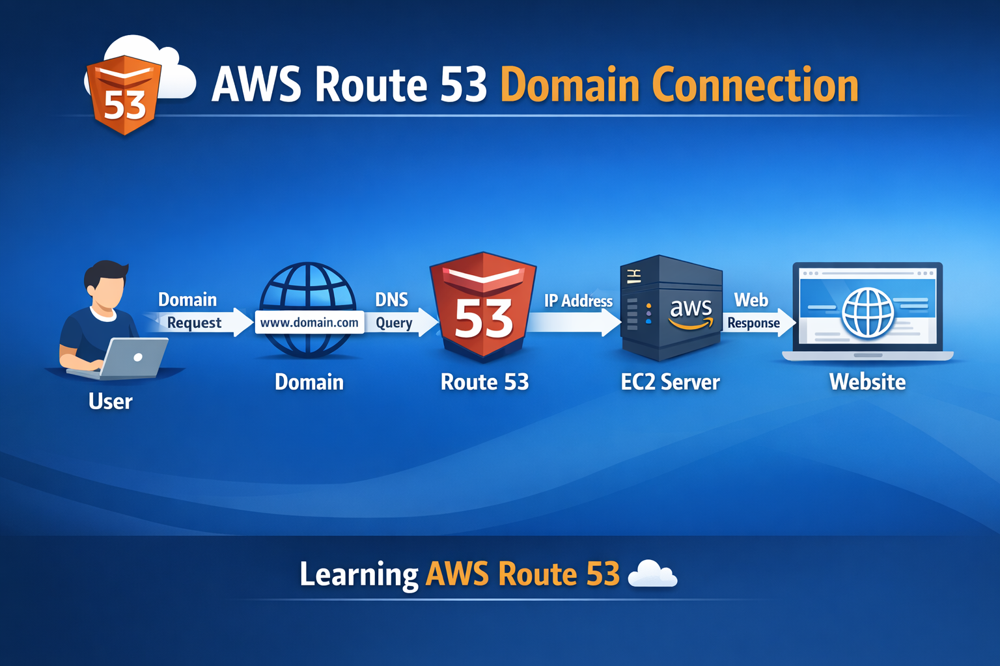

# ☁️ AWS Route 53 Project

## 📌 Project Overview
This project demonstrates how AWS Route 53 connects a domain name to an EC2 server using DNS configuration.

The goal of this project is to understand how domain routing and DNS work in AWS cloud.

---

## 🧰 Services Used

- AWS Route 53
- AWS EC2
- DNS
- Cloud Networking

---

## ⚙️ Steps Performed

1. Opened AWS Console
2. Selected Route 53
3. Created Hosted Zone
4. Added Domain Name
5. Configured DNS Records (A Record, CNAME)
6. Connected EC2 Public IP
7. Website became live

---

## 📊 Architecture

User → Domain → Route 53 → EC2 → Website

---

## 🖼️ Project Image

---

## 🎯 Learning

- DNS Working
- Hosted Zone
- Domain Routing
- AWS Route 53
- EC2 Connection
- Cloud Networking

---

## 📌 Author

**Aarti Kale**

---

## 🔗 GitHub Project

AWS Route 53 Learning Project
